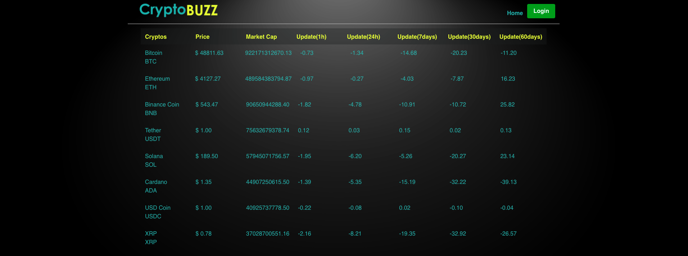
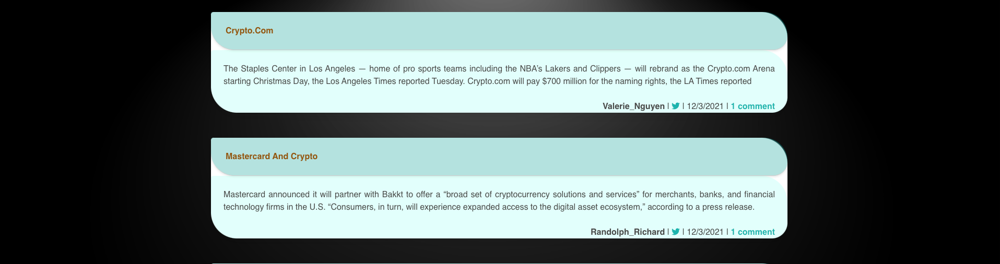
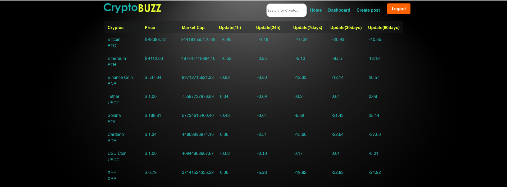
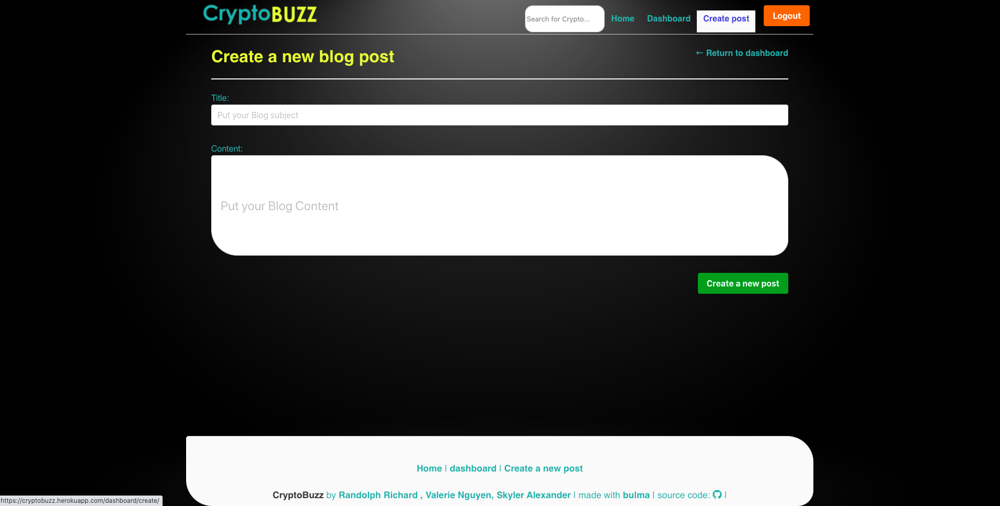
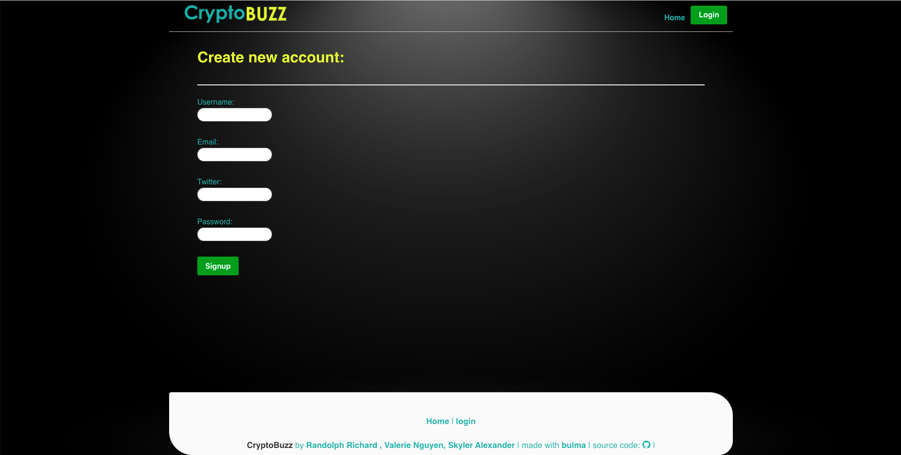
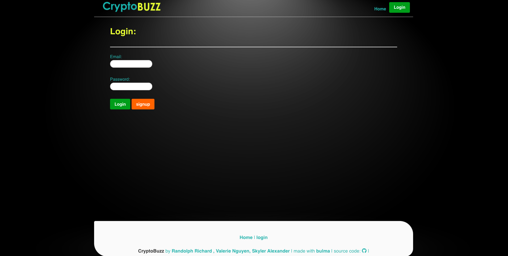

# cryptobuzz

* Our app can be found at:
https://cryptobuzz.herokuapp.com/

## User Story

As an investor with a busy schedule
I want an application that I can access to find all the information I need about a cryptocurrency
So that I can make an informed decision in my investment

## Acceptance Critera

Given an application with information about cryptocurrency
* When I open the application
Then the top 8 cryptocurrency is displayed
* When I login
Then I am presented with a main page with a search bar , your own dashboard and forum
* When I use the searchbar
Then I can search the cryptocurrency I want to know about and it will list all the information I need
* When I scroll down 
Then I am presented with a forum
* When I am using the forum, once logged In 
Then I can comment and post in the forum
* When I open the Dashboard
Then I can see all my posts and comments 
* When IuUse different devices
Then the app is responsive

# Installation needed:

* axios
* bcrypt
* bulma
* connect-session-sequelize
* dotenv
* express
* express-handlebars
* express-session
* mysql2
* nodemon
* sequelize

# Personal note
* After you run the NPM installs in order to get the node_modules, create the .env file and add these codes:
DB_NAME='cryptobuzz'
DB_USER='root'
DB_PW='*****'
* After you logout, in order to log back in with the same credentials, you need to remember your email.

# Screenshots:

## Front Page

## Front Page once Logged In

## Create Post

## Sign Up

## Login

Enjoy!